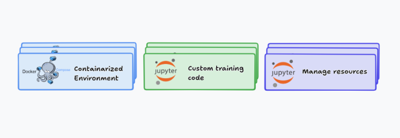
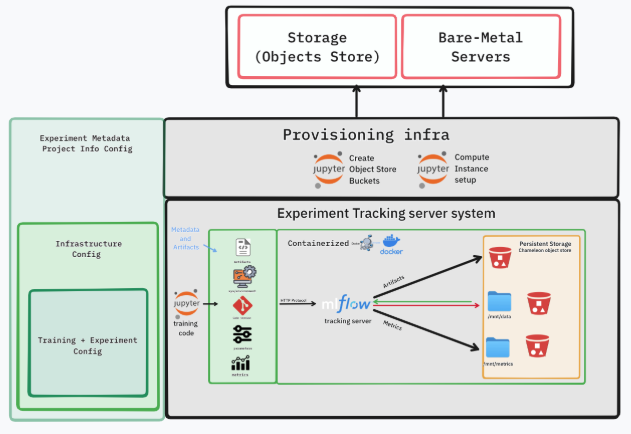
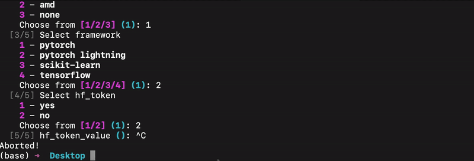

### Refresher about the Project 
Hi everyone! for the last month I have been working with my mentors Professor [Fraida Fund](https://ucsc-ospo.github.io/author/fraida-fund/), and [Mohamed Saeed](https://ucsc-ospo.github.io/author/mohamed-saeed/) on our Project [Applying MLOps to overcome reproducibility barriers in machine learning research](https://ucsc-ospo.github.io/project/osre25/nyu/mlops/) As a refresher, our goal is to build a template generator for a reproducible machine learning training workflows at the Chameleon testbed. We want to provide our users with the necessary environment configuration in a handy way. so they won't be overwhelmed with all the intricate details of setting the environment. This will allow for validation and further development of their setup. 

--- 

### What we have done so far



in the process of building a template generator that will provide the user with the notebooks to communicate with chameleon testbed resources, containerized environment and custom training scripts so far we finished the rseource reservation and server setup notebooks (amd and nvidia) the work in the custom training code and containerized environment is as follow.

#### We finalized the selection of frameworks and storage options.



Artifacts are now logged directly from the MLflow server to the Chameleon object store, without relying on a database backend or an intermediate MinIO S3 layer.
 
#### Different jupyter lap images for each framework.
We’ve started with the top ML frameworks — PyTorch Lightning, Keras/TensorFlow, and Scikit-Learn. Each framework now has its own image, which will later be tailored to the user’s selection.

#### Github CLI and Hugging Face integration with the Jupyter notebooks. 
The Jupyter container now integrates both the GitHub CLI and Hugging Face authentication. Users can manage their code repositories via GitHub CLI commands and authenticate with Hugging Face tokens to download/upload models and datasets. This eliminates the need for manual credential setup and streamlines ML experimentation within the environment.


#### Custom Logging Utility  
To ensure robust tracking of code versioning and environment details, we added a custom logging utility.  
These logs are stored alongside metrics and model artifacts in MLflow, ensuring every experiment is fully documented and reproducible.  

---

##### `log_git()` — Captures Code Versioning  
Uses Git commands (via subprocess) to log:  
- Current branch name  
- Commit hash  
- Repository status (clean or dirty)  

**Example Output:**  
```text
commit: a7c3e9d
branch: main
status: dirty (1 file modified)
```


##### `log_python()`— Tracks the Python Environment

- Exports a full pip freeze list to a .txt file

- Saved as an MLflow artifact to guarantee exact package version reproducibility

Example Output (pip freeze extract):
```txt 
numpy==1.26.4
pandas==2.2.1
scikit-learn==1.4.2
torch==2.2.0
```

##### `log_gpu()` - Records GPU Information

- Detects available GPU devices

- Collects details using NVIDIA’s pynvml or AMD’s ROCm tools

- Logs:

 - GPU name

 - Driver version

 - CUDA/ROCm version

 - Captures <gpu-type>-smi output for deeper inspection

---

These utilities ensure that each run can be traced back with:

- The exact code version

- The full Python environment

- The hardware details used

---

### Initial customizable template 

We’ve prototyped an initial customizable template using Cookiecutter. it provides an interactive CLI, users provide some key project details (e.g., project name, frameworks, GPU type and integrations if any). Cookiecutter then generates a ready-to-use project structure with pre-configured integrations, reducing manual setup and ensuring consistency across environments.



### What’s Next

- **Template Generation via Config + interactive widgets**  
  We are exploring different ways to generate experiment templates using configuration files and interactive widgets in jupyter notebooks. This would let users quickly customize logging setups and considered to be more user-friendly.  

- **AMD-Compatible Images**  
  Extend support by building and testing Docker images optimized for AMD GPUs. Up to now, our development efforts has focused on NVIDIA GPUs using CUDA-based images

- **End-to-End Lifecycle Example**  
  Provide a larger example demonstrating the entire ML workflow:  
  - Data preparation  
  - Training with GPU logging  
  - Tracking metrics, artifacts, and environment info in MLflow  
  - Model evaluation and logging  
  - Reproducing results on different hardware backends  


Working on this project so far has been both challenging and eye-opening. I’ve seen how many moving parts need to come together for a smooth workflow. The support from my mentors has been key in helping me turning challenges into real progress.  

Thank you for following along — I’m looking forward to sharing more concrete results soon.