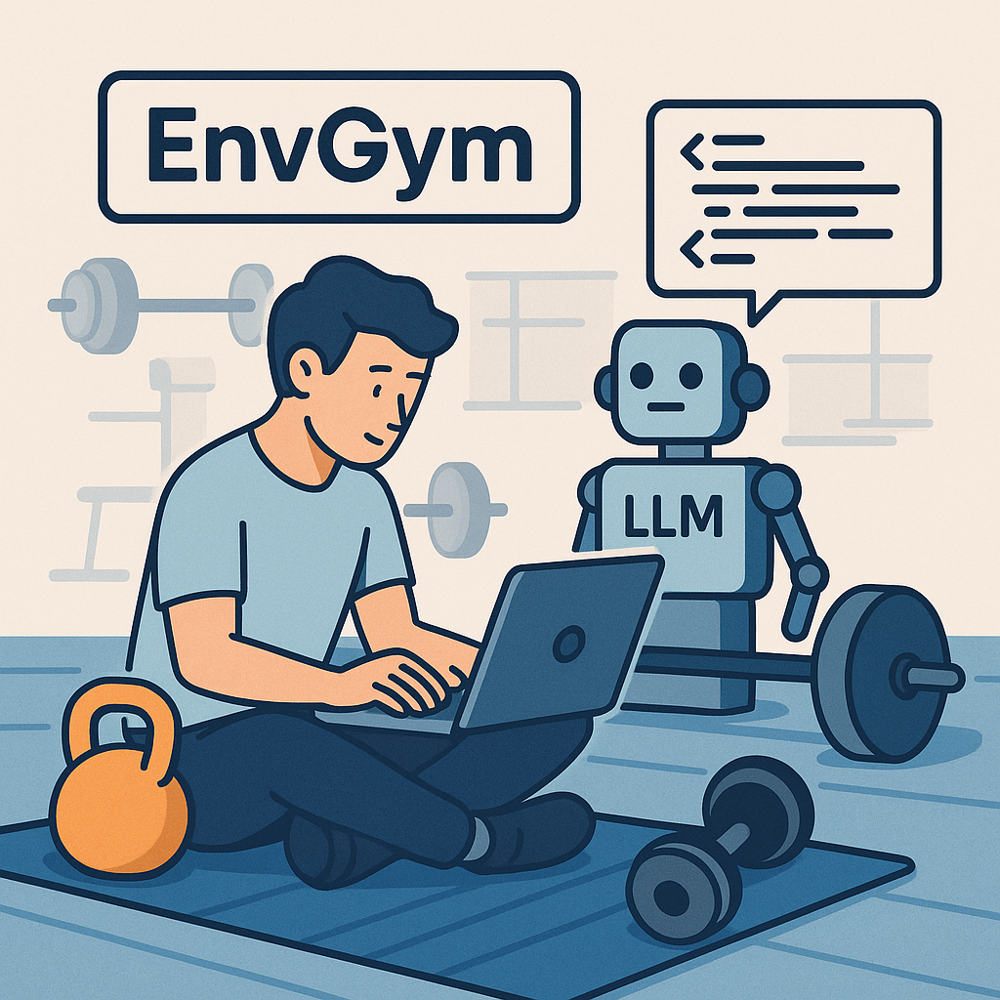
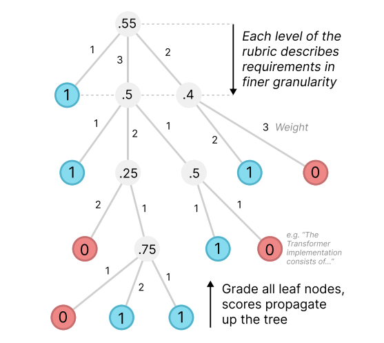

## What is EnvGym?
EnvGym is a general multi-agent framework designed to automate the construction of executable environments for reproducing research prototypes from top-tier conferences and journals. While reproducibility has become a growing concern in the research community, the process of setting up environments remains time-consuming, error-prone, and often poorly documented.

EnvGym addresses this gap by leveraging LLM-powered agents to analyze project instructions, resolve dependencies, configure execution environments, and validate results—thereby reducing human overhead and improving reproducibility at scale.

## Progress

### New Tools
Initially, our agent had access to only one tool: the command line. This constrained the agent’s ability to decompose complex tasks and respond flexibly to failures. Over the last few weeks, we introduced a modular tool system, enabling the agent to handle specific subtasks more effectively.

The new toolset includes:

- dockerrun: Executes Dockerfiles.

- hardware_checking, hardware_adjustment: Tailor builds to available resources.

- history_manager, stats: Tracks historical data for improvement and reproducibility.

- planning: Generates high-level execution plans.

- summarize: Interprets build results to adjust subsequent iterations.

- writing_docker_initial, writing_docker_revision: Generate and refine Dockerfiles.

While some of those tools, such as dockerrun, run programmatic scripts, other scripts such as planning are more complex and use LLMs themselves.

### Agent Re-Architecture: Moving Beyond Codex
We transitioned away from OpenAI's Codex agent implementation. While powerful, Codex's framework was overly reliant on its CLI frontend, which added unnecessary complexity and limited customizability for our research context.

We implemented our own lightweight, customizable agent pipeline that integrates LLM-based planning with iterative execution. Conceptually, the agent executes the following loop:

- Repo Scanning

- Hardware Check

- Planning & Initial Dockerfile Generation

- Docker Execution

- Progress Summarization & Adjustment

- Iterative Dockerfile Refinement (up to 20 rounds)

- Success Check & Logging

This new agent design is easier to control, extend, and debug—aligning better with the needs of reproducibility research.
### Prompt Engineering
For each tool that requires LLMs to function, we created a set of custom prompts that outline the task and breaks down the goals. For instance, the prompt used in summarize differs from the one in planning, allowing us to optimize the behavior of LLM agents per context.

### Performance Gains
With these improvements, EnvGym now successfully replicates 9 repositories, surpassing our baseline Codex agent which struggled with the same set. We’ve observed more reliable planning, better handling of edge-case dependencies, and faster convergence in iterative Dockerfile revisions.

## Next Steps
### Granular Evaluation Metric
We plan to adopt a tree-structured rubric-based evaluation, inspired by PaperBench. Instead of binary success/failure, each repo will be assigned a reproducibility score from 0–100.

Key tasks include:

- Rubric Design: Define a hierarchical rubric with criteria like dependency resolution, test success rate, runtime match, etc.

- Manual Annotation: Build a dataset of ground-truth rubrics for a subset of repos to calibrate our automatic judge.

- Judge Implementation: Develop an LLM-based judge function that takes (i) rubric and (ii) environment state, and returns a reproducibility score.

Source: Starace, Giulio, et al. "PaperBench: Evaluating AI's Ability to Replicate AI Research." arXiv preprint arXiv:2504.01848 (2025).

This will make EnvGym suitable for benchmarking. We will run our new method and obtain a score to compare with baseline methods!

## Conclusion
EnvGym has made strong progress toward automating reproducibility in computational research. Through modularization, agentic design, and prompt optimizations, we’ve surpassed existing baselines and laid the groundwork for even more improvement.

The upcoming focus on metrics and benchmarking will elevate EnvGym from a functional prototype to a standardized reproducibility benchmark tool and also quantitatively prove that our new agentic method is better than existing tools such as Codex. Excited for what's to come!

Autofill

;
20250724-Sam_Huang
